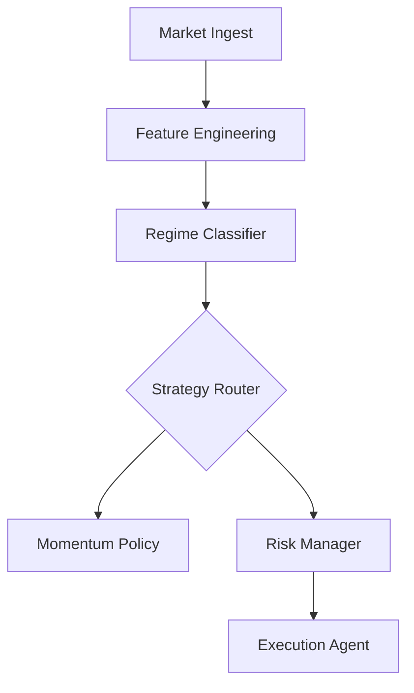

# LangGraph Trading Agent

This project implements a **modular, event‑driven trading agent** built on **LangGraph**. It runs a full pipeline:

> Market Ingest → Feature Engineering → Regime Classification → Strategy Router → [Momentum / Mean Reversion] → Risk Manager → Execution Agent

The system supports **multiple trading backends**:

- **Binance** (testnet/mainnet for crypto)
- **Alpaca** (paper trading for stocks and crypto)

It's designed to support **backtesting** and **simulation** via a LOB simulator and metrics utilities.

---

## 1. Key Features

✅ **Multi-Provider Support**: Switch between Binance and Alpaca with a single config change  
✅ **Paper Trading**: Test strategies risk-free using Alpaca's paper trading  
✅ **LLM-Powered**: Uses Google Gemini for intelligent regime classification  
✅ **Health Checks**: Validates all API connections before trading starts  
✅ **Modular Architecture**: Easy to extend with new strategies or providers  
✅ **Comprehensive Testing**: Unit tests for all major components  

---

## 2. Project Layout

- `src/app/config.py` – application settings (env‑driven via `pydantic-settings`).
- `src/app/main.py` – main entrypoint, runs the full LangGraph trading loop.
- `src/app/langgraph_graphs/`
  - `ingest_graph.py` – market data ingestion subgraph.
  - `momentum_graph.py` – feature + momentum strategy subgraph.
  - `full_mvp_graph.py` – full end‑to‑end trading graph.
- `src/app/nodes/` – pipeline nodes:
  - `market_ingest.py` – load market data (Binance or CSV stub).
  - `feature_engineering.py` – compute EMA(9/50), ATR, realized volatility, OB imbalance, VWAP.
  - `regime_classifier.py` – rule‑based regime classifier with LLM fallback.
  - `strategy_router.py` – route to momentum / mean reversion / neutral strategy.
  - `momentum_policy.py` – EMA‑crossover momentum strategy.
  - `mean_reversion_policy.py` – RSI + Bollinger Bands mean reversion strategy.
  - `hedge_agent.py` – hedge spot positions with futures.
  - `risk_manager.py` – risk checks + position sizing.
  - `execution_agent.py` – place orders via Binance tool.
  - `data_sanitizer.py` – data integrity filter.
- `src/app/schemas/` – Pydantic models for events (`TradeEvent`, `OrderbookUpdate`, `KlineEvent`) and domain models (`MarketFeatures`, `Signal`, `Order`, `PortfolioState`, etc.).
- `src/app/tools/`
  - `binance_tool.py` – async Binance client wrapper.
  - `alpaca_tool.py` – Alpaca paper trading client wrapper.
  - `kotak_neo_tool.py` – Kotak Neo API wrapper (Experimental).
  - `trading_provider.py` – abstraction layer for switching between providers.
  - `llm_tool.py` – Google Gemini LLM wrapper for regime classification / advice.
  - `mock_tool.py` – simulation tool.
- `src/app/utils/`
  - `backtester.py` – simple backtesting engine driven by strategy signals.
  - `lob_simulator.py` – limit order book simulator.
  - `metrics.py` – Sharpe / max drawdown / win‑rate and other metrics.
  - `persistence.py` – state persistence.
  - `resilience.py` – API retry logic.
  - `statistics.py` – statistical calculations.
- `src/tests/` – minimal tests for ingest, features, strategies, and execution agent.
- `scripts/`
  - `run_backtest.py` – main backtesting CLI.
  - `run_paper_trade.py` – specialized 15m strategy runner.
  - `convert_nifty_data.py` – Nifty data formatter.
  - `fetch_data.py` – historical data fetcher.
  - `fetch_gap_data.py` – gap analysis utility.
  - `analyze_ofi.py` – OFI analysis utility.
  - `download_trades.py` – trade history downloader.
  - `reconstruct_orderbook.py` – LOB reconstruction utility.
  - `verify_setup.sh` – environment verification.
  - `quickstart.py` – interactive setup wizard.

---

## 3. Requirements

- Python **3.11+**
- Recommended: **Poetry** for dependency management

Python dependencies are defined in `pyproject.toml` including:

- LangGraph, LangChain
- Pydantic v2
- `python-binance` (for Binance support)
- `alpaca-py` (for Alpaca paper trading)
- `langchain-google-genai` (for Gemini LLM)
- `pytest` and development tools

---

## 4. Quick Setup (Easiest)

For first-time setup, use our interactive configuration script:

```bash
cd /Users/kevin/Desktop/Ai_agent_trade_claude
poetry install
poetry run python scripts/quickstart.py
```

This will guide you through:

- Choosing a trading provider (Alpaca or Binance)
- Entering API credentials
- Setting risk parameters
- Creating your `.env` file

Then jump to **Section 5** to start trading!

---

## 5. Manual Setup (Alternative)

### 4.1 Install Dependencies

Using Poetry (recommended):

```bash
cd /Users/kevin/Desktop/Ai_agent_trade_claude
poetry install
```

Or using pip directly:

```bash
python -m venv .venv
source .venv/bin/activate  # macOS / Linux
pip install -e .
```

### 4.2 Get API Credentials

#### For Alpaca Paper Trading (Recommended for Testing)

1. Go to <https://alpaca.markets/>
2. Sign up for a free account
3. Navigate to Paper Trading dashboard
4. Copy your API Key and Secret Key

#### For Binance (Crypto Trading)

1. Go to <https://testnet.binance.vision/> (testnet) or binance.com (mainnet)
2. Create API keys
3. Enable spot trading permissions

#### For Gemini LLM

1. Go to <https://ai.google.dev/>
2. Get your Gemini API key

### 4.3 Environment Variables

Create a `.env` file in the project root:

```env
# Trading Provider Selection
# Options: "binance" or "alpaca"
TRADING_PROVIDER="alpaca"

# Binance API Keys (for testnet or mainnet)
BINANCE_API_KEY="your-binance-testnet-key"
BINANCE_API_SECRET="your-binance-testnet-secret"

# Alpaca API Keys (always uses paper trading)
ALPACA_API_KEY="your-alpaca-paper-key"
ALPACA_API_SECRET="your-alpaca-paper-secret"

# Gemini LLM API Key
GEMINI_API_KEY="your-gemini-key"

# Trading Configuration
SYMBOL="BTCUSD"  # Use BTCUSD for crypto on Alpaca, AAPL for stocks, or BTCUSDT for Binance
TESTNET=true  # Only applies to Binance

# Logging
LOG_LEVEL="INFO"
```

**Important Notes:**

- **Alpaca** always uses paper trading (safe for testing)
- **Binance** can use testnet (safe) or mainnet (real money) - set `TESTNET=true` for safety
- Symbol formats differ:
  - Alpaca: `BTCUSD` (crypto), `AAPL` (stocks)
  - Binance: `BTCUSDT` (crypto)

All settings are defined in `src/app/config.py` and loaded via `Settings`.

### 4.4 Run Health Checks

Before running the trading system, validate that all APIs are working:

```bash
poetry run python -m app.healthcheck
```

This will verify:

- ✅ Trading provider connectivity (Binance or Alpaca)
- ✅ Market data access
- ✅ Portfolio state retrieval
- ✅ Gemini LLM connectivity

Expected output:

```bash
Running external health checks (ALPACA, Gemini)...
✅ All health checks passed
{'trading_provider': {'provider': 'alpaca', 'symbol': 'BTCUSD', 'ok': True, ...}, 'llm': {'model': 'gemini-1.5-pro', 'ok': True, ...}}
```

---

## 6. Running the Trading System

### 5.1 Start Live Trading (or Paper Trading)

To launch the main trading agent:

```bash
poetry run python -m app.main
```

This command acts as the entry point for the **LangGraph** agent. It will:

1. **Run Health Checks**: Validates API connections (Binance/Alpaca, Gemini LLM).
2. **Initialize Components**: Sets up the Strategy Router, Risk Manager, and Execution Agent.
3. **Start Loop**: Enters a persistent loop (default: 60s interval) to trading.

### 5.2 Switching Between Providers (Live vs. Paper)

Control the trading mode via your `.env` file:

**Option A: Alpaca Paper Trading (Risk-Free)**

```env
TRADING_PROVIDER="alpaca"
SYMBOL="BTCUSD"
```

*Best for: Testing strategy logic and execution flow without real money.*

**Option B: Binance Testnet (Crypto Simulation)**

```env
TRADING_PROVIDER="binance"
TESTNET=true
SYMBOL="BTCUSDT"
```

*Best for: Testing crypto-specific microstructure.*

**Option C: Binance Mainnet (REAL MONEY)**

```env
TRADING_PROVIDER="binance"
TESTNET=false
SYMBOL="BTCUSDT"
```

*⚠️ WARNING: This will trade real funds. Ensure you have tested thoroughly.*

### 5.3 Monitoring

The system logs all decisions to the console. You can also monitor the `logs/` directory if configured.

---

## 7. Backtesting & Analysis

 We support two distinct backtesting modes: **Vectorized** (for long-term statistical validation) and **Event-Driven** (for granular strategy simulation).

### 7.1 Verified Performance (The "Holistic Review" Results)

 Our core **Momentum v3** strategy has been rigorously stress-tested across 5 years of historical data (2020-2025). The system utilizes a "Low Noise" hypothesis, relying on strong trend filters (EMA200) and volatility checks to ensure safety.

 **Key Performance Metrics (2020-2025):**

 | Metric | Result | Notes |
 | :--- | :--- | :--- |
 | **Total Return** | **+156.64%** | Excellent growth over 5 years (Event-Driven). |
 | **Max Drawdown** | **10.72%** | Robust risk profile even with slippage. |
 | **Sharpe Ratio** | **5.29** | High risk-adjusted return. |
 | **Win Rate** | **36.85%** | Typical trend following profile (big wins, small losses). |
 | **Avg Win/Loss** | **2.27** | Strong profitability per trade. |

 *Source: `docs/analysis/project_holistic_review.md` & Live Backtest*

### 7.2 Reproducing the Results

 To reproduce these exact figures using the event-driven backtester (which simulates 15-minute candles, spreads, and strategy logic):

 ```bash
 # Full 5-Year Backtest (2000 Days)
 poetry run python scripts/run_backtest.py --symbol BTCUSDT --data_file data/BTCUSDT_5Y_MASTER.csv --strategy momentum --days 2000 --visual
 ```

 *Note: This requires the `data/BTCUSDT_5Y_MASTER.csv` file to be present.*

### 7.3 Other Backtest Modes

 **Quick Vectorized Test (Fast Check)**
 For a rapid check of the underlying signal logic without event-driven delays:

 ```bash
 poetry run python scripts/quick_vectorized_test.py
 ```

 **Recent Performance (Last 7 Days)**

 ```bash
 poetry run python scripts/run_backtest.py --days 7 --strategy momentum --visual
 ```

 **Features:**

- Simulates the Order Book (LOB).
- Injects random slippage and latency.
- Full replay of the agent's decision-making graph.

---

## 8. Running Tests

Tests live under `src/tests` and are configured via `pytest.ini`.

```bash
# from project root
poetry run pytest -q

# Run with verbose output
poetry run pytest -v

# Run specific test file
poetry run pytest src/tests/test_ingest.py
```

Tests are designed to be **offline** and should not hit external APIs; tools are mocked or stubbed where needed.

---

## 9. Architecture Highlights

### 7.1 Trading Provider Abstraction

The `TradingProvider` protocol in `trading_provider.py` provides a unified interface:

```python
from app.tools.trading_provider import trading_provider

# Works with both Binance and Alpaca
orderbook = await trading_provider.get_orderbook(symbol)
result = await trading_provider.execute_order(order)
```

### 7.2 Health Check System

Before trading starts, the system validates:

- API credentials are correct
- Market data is accessible
- Orders can be placed (paper trading mode)
- LLM is responding correctly

This prevents runtime failures and wasted time.

### 7.3 LangGraph Pipeline

The trading logic is implemented as a directed graph:



Each node is independently testable and can be swapped out.

---

## 10. Configuration Options

Key settings in `.env`:

| Variable | Description | Default | Options |
|----------|-------------|---------|---------|
| `TRADING_PROVIDER` | Which exchange to use | `binance` | `binance`, `alpaca` |
| `SYMBOL` | Trading pair | `BTCUSDT` | Any valid symbol for provider |
| `TESTNET` | Use testnet (Binance only) | `true` | `true`, `false` |
| `GEMINI_API_KEY` | Gemini LLM key | - | Required |
| `MAX_POSITION_SIZE` | Max position size | `0.1` | Any float |
| `MAX_DRAWDOWN_PERCENT` | Max drawdown % | `10.0` | Any float |
| `LOOP_INTERVAL_SECONDS` | Time between iterations | `60` | Any integer |
| `LLM_MODEL` | Gemini model | `gemini-1.5-pro` | Any Gemini model |
| `RSI_PERIOD` | RSI period | `14` | Integer |
| `RSI_OVERBOUGHT` | RSI overbought threshold | `70` | Integer |
| `RSI_OVERSOLD` | RSI oversold threshold | `30` | Integer |
| `BOLLINGER_PERIOD` | Bollinger Band period | `20` | Integer |
| `BOLLINGER_STD_DEV` | Bollinger Band std dev | `2.0` | Float |

---

## 11. Safety Features

✅ **Paper Trading First**: Alpaca provider always uses paper trading  
✅ **Health Checks**: Validates APIs before trading  
✅ **Risk Limits**: Configurable position size and drawdown limits  
✅ **Error Handling**: Graceful degradation on API failures  
✅ **Testnet Support**: Binance testnet for safe crypto testing  
✅ **Comprehensive Logging**: Full audit trail of all decisions  

---

## 12. Next Steps

1. **Test with Paper Trading**: Start with Alpaca paper trading to validate strategy
2. **Backtest**: Enable backtesting mode with historical data
3. **Add Strategies**: Implement additional strategies (e.g. Breakout) beyond Momentum and Mean Reversion
4. **Tune Parameters**: Optimize EMA periods, risk limits, etc.
5. **Monitor Performance**: Track Sharpe ratio, win rate, drawdown
6. **Go Live (Carefully)**: Only after extensive testing with paper trading

---

## 15. Troubleshooting

**Health checks fail**: Check API keys in `.env`, verify network connectivity

**"Provider not found" error**: Ensure `TRADING_PROVIDER` is set to `binance` or `alpaca`

**Symbol format error**: Use correct format for provider (BTCUSDT for Binance, BTCUSD for Alpaca)

**LLM errors**: Verify `GEMINI_API_KEY` is valid and you have API quota

**Import errors**: Run `poetry install` to ensure all dependencies are installed

---

## 16. Contributing

To add a new trading provider:

1. Create a tool in `src/app/tools/` implementing the `TradingProvider` protocol
2. Add provider selection logic in `trading_provider.py`
3. Add configuration variables in `config.py`
4. Update health checks in `healthcheck.py`
5. Add tests

---

## License

MIT License - see LICENSE file for details.

---

## 13. Deployment

### 13.1 Docker

The `docker/` folder contains a `Dockerfile` and `docker-compose.yml`. A typical workflow:

```bash
docker compose up --build
```

Ensure the container sets `PYTHONPATH=/src` (already handled in the Dockerfile) so that `import app` works.

### 13.2 Kubernetes

The `k8s/` manifests provide a basic deployment and service for running the agent in a cluster. You will want to:

- Mount configuration / secrets via Kubernetes Secrets and ConfigMaps.
- Ensure resource limits, liveness/readiness probes, and logging are configured for your environment.

### 13.3 CI (GitHub Actions)

The `ci/github-actions.yaml` workflow is intended to:

- Install Python and dependencies.
- Run `pytest` on every push / PR.

---

## 14. Roadmap

1. **Deployment**: Implement `leverage_manager` node for smart sizing.
2. **Strategy**: Add **Breakout Strategy** node.
3. **Data**: Integrate Polygon.io for deeper order book data.
4. **Monitoring**: Add Prometheus/Grafana exporter.

This README will evolve as the system grows; contributions and refinements are welcome.
